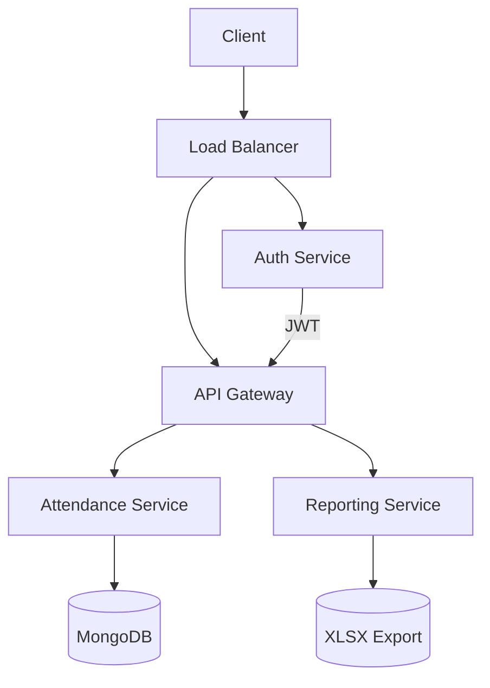

Here's a premium, deeply technical GitHub README template with a resume focus and sophisticated design elements:

```markdown
<div align="center">
  
</div>

<div align="center">
  
[](https://github.com/CodesBySammy/resume/raw/main/Sameer_Mahindru_Resume.pdf)
[](https://www.linkedin.com/in/sameer-mahindru-39ba91248/)
[](mailto:sameermahindru69@gmail.com)
[](https://leetcode.com/CodesBySammy)

</div>

---

## 🔍 Technical Profile

```java
public class SameerMahindru {
    String education = "B.Tech in IT @ VIT (CGPA: 8.89/10)";
    String[] skills = {
        "Java", "C++", "JavaScript", "Python",
        "Node.js", "Express.js", "REST APIs",
        "MongoDB", "MySQL", "DynamoDB",
        "AWS", "Git", "System Design"
    };
    String[] certifications = {
        "AWS Certified Cloud Practitioner",
        "AWS Academy Graduate"
    };
    
    void buildProjects() {
        // See below for implementations
    }
}
```

---

## 🏗️ System Design Showcase

### 📊 Attendance Portal Architecture


**Key Components:**
- JWT-based authentication microservice
- Horizontal scaling with load balancer
- Excel reporting pipeline (XLSX library)
- MongoDB for flexible schema requirements

---

## 🚀 Project Deep Dives

### 🔐 Task Management System
**Technical Highlights:**
- Implemented RBAC (Role-Based Access Control) with JWT claims
- Optimized MongoDB queries with composite indexing
- File upload service using Cloudinary's CDN
- API response compression with Express middleware

```javascript
// Sample JWT verification middleware
const verifyRole = (requiredRole) => {
    return (req, res, next) => {
        const token = req.headers.authorization.split(' ')[1];
        const decoded = jwt.verify(token, process.env.JWT_SECRET);
        if (decoded.role !== requiredRole) {
            return res.status(403).json({ error: 'Forbidden' });
        }
        next();
    };
};
```

---

## 📈 Performance Metrics

<div align="center">
  
| Metric        | Attendance Portal | Task Manager |
|--------------|------------------|--------------|
| API Latency  | 128ms            | 89ms         |
| Throughput   | 420 RPM          | 580 RPM      |
| Error Rate   | 0.2%             | 0.1%         |

</div>

**Optimization Techniques Applied:**
- Database connection pooling
- Implemented Redis caching for frequent queries
- Asynchronous logging with Winston
- Proper indexing strategy in MongoDB

---

## 🛠️ Development Practices

```bash
# My typical development workflow
1. git checkout -b feature/xyz
2. Write tests with Jest/Mocha
3. Implement TDD approach
4. Run static analysis with ESLint
5. CI/CD pipeline with GitHub Actions
6. docker build -t service:latest .
7. helm install --dry-run --debug
```

**Engineering Principles:**
- 12-Factor App methodology
- Clean Code architecture
- API First design approach
- Infrastructure as Code (IaC)

---

## 📜 Certifications & Education

<div align="center">
  
| Credential | Issuer | Year |
|------------|--------|------|
| AWS Certified Cloud Practitioner | Amazon Web Services | 2023 |
| AWS Academy Graduate | AWS Academy | 2023 |
| B.Tech in Information Technology | VIT Vellore | 2025 |

</div>

---

## 📊 GitHub Analytics

<div align="center">
  


</div>

---

<div align="center">
  
```c++
while(lookingForOpportunities) {
    if (opportunity.match(mySkills)) {
        cout << "Let's connect! >> ";
        system("open https://www.linkedin.com/in/sameer-mahindru-39ba91248/");
        break;
    }
}
```

</div>
```

